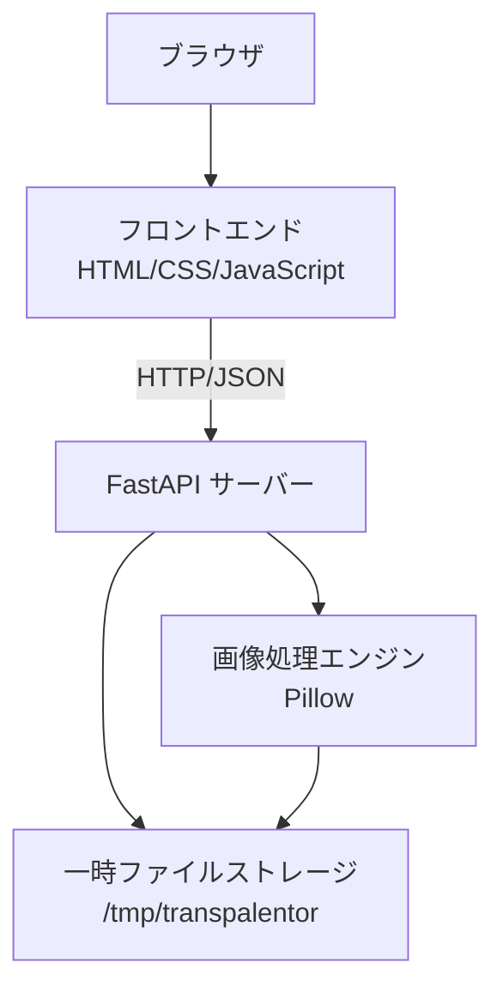
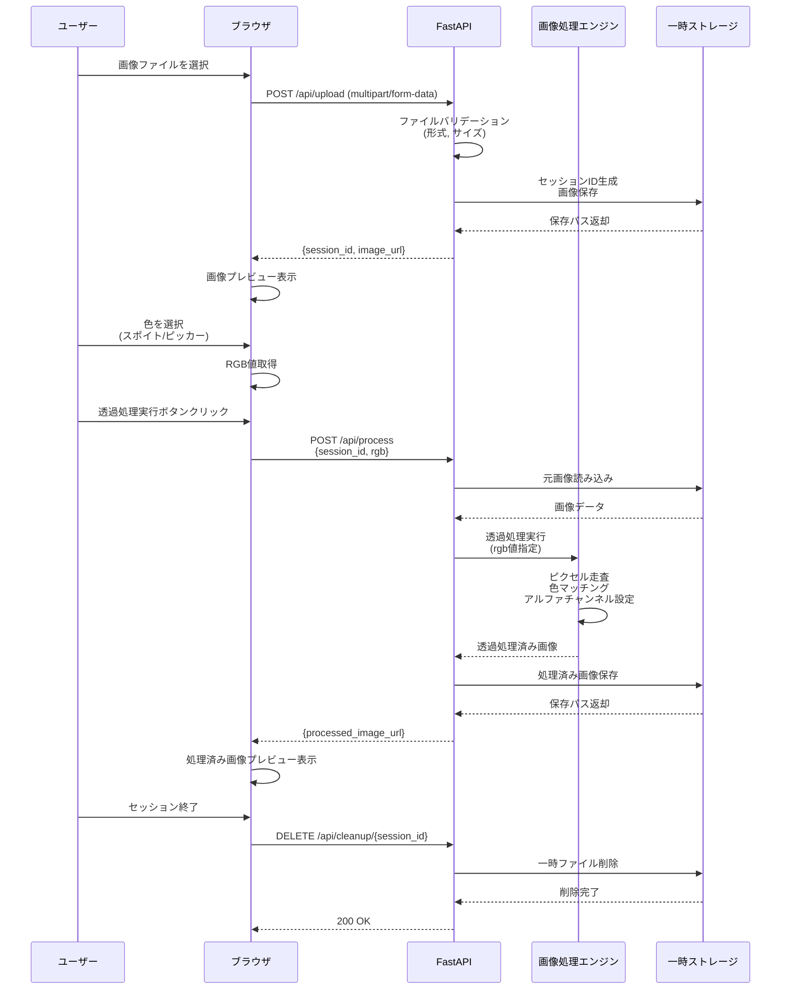
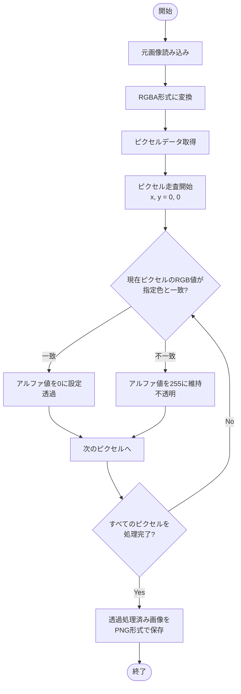
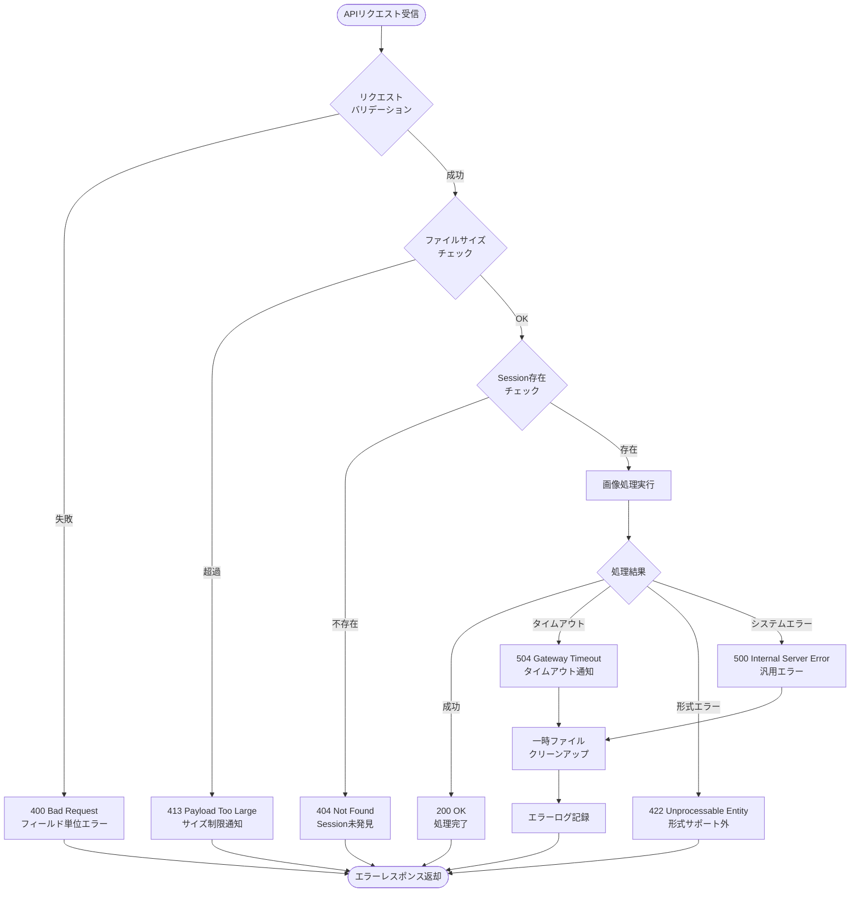

# 技術設計書

## 概要

Transpalentorは、指定した色を透過処理するブラウザベースの画像編集Webアプリケーションである。ユーザーはローカル画像をアップロードし、スポイトツールまたはカラーピッカーで透過対象色を選択し、処理結果をリアルタイムでプレビューできる。デザイン作業や画像編集において、特定色の背景除去を手軽に実行する手段を提供する。

**対象ユーザー:** デザイナー、画像編集者、およびWebコンテンツ制作者が、透過PNG作成のために利用する。
**影響:** 新規開発のため、既存システムへの影響はない。

### ゴール
- ブラウザ上で画像ファイルをアップロードし、指定色を透過処理できること
- スポイトツール(ブラウザ対応時)またはカラーピッカー/RGB入力で色を選択できること
- 透過処理結果をリアルタイムでプレビュー表示し、元画像と比較できること
- ローカル環境で簡単にサーバーを起動し、ブラウザからアクセスできること
- アップロードされた画像を一時保存し、処理後は自動的にクリーンアップすること

### 非ゴール
- 画像編集機能(リサイズ、回転、フィルタ等)の提供は本スコープ外
- 画像の永続的な保存やユーザーアカウント管理は実装しない
- 複数画像の一括処理やバッチ処理は現時点でサポートしない
- 色の近似マッチング(類似色の透過)や、許容範囲を指定した透過処理は将来的な拡張として検討

## アーキテクチャ

### 高レベルアーキテクチャ



**アーキテクチャの統合:**
- **既存パターンの保持:** 新規開発のため該当なし
- **新規コンポーネントの理由:**
  - FastAPIサーバー: 高速な非同期処理とファイルアップロードの標準サポート
  - Pillow画像処理エンジン: PNG透過処理のための軽量なライブラリ
  - HTML/CSS/JavaScriptフロントエンド: ブラウザ標準技術で実装の簡潔性を維持
- **技術スタックの整合性:** Pythonエコシステムの標準的な構成を採用
- **ステアリングへの準拠:** データベース不使用、一時ファイル管理、ローカルサーバー起動の要求を満たす

### 技術スタックと設計判断

#### バックエンド技術スタック
- **Webフレームワーク:** FastAPI 0.115+
  - **選定理由:** 非同期処理、型ヒントによる自動バリデーション、ファイルアップロードの標準サポート、自動ドキュメント生成
  - **代替案検討:**
    - Flask: 成熟した軽量フレームワークだが、非同期処理はWSGI制約があり、画像処理のような重い処理には不向き
    - Django: フル機能だがデータベースや認証などの不要な機能が多く、オーバースペック
- **画像処理ライブラリ:** Pillow 10.0+
  - **選定理由:** PNG透過処理の標準的な手段、軽量、純粋Pythonでのインストールが容易
  - **代替案検討:**
    - OpenCV: コンピュータビジョン向けで高機能だが、単純な色指定透過処理にはオーバースペック、依存関係が重い
    - scikit-image: 科学計算向けで本用途には不要な機能が多い
- **バリデーションライブラリ:** Pydantic 2.0+ (FastAPIに含まれる)
  - **選定理由:** 型安全なリクエスト/レスポンス定義、自動バリデーション

#### フロントエンド技術スタック
- **フロントエンド:** HTML5 + CSS3 + Vanilla JavaScript (ES6+)
  - **選定理由:** 軽量、依存関係なし、ブラウザ標準APIで十分な機能を実現可能
  - **代替案検討:**
    - React/Vue.js: 本アプリケーションの規模では過剰、ビルドツールやバンドラの導入が必要
    - jQuery: 現代のブラウザではVanilla JSで十分対応可能、余分な依存関係を避ける
- **色選択API:** EyeDropper API (Chromiumブラウザ) + フォールバック(Canvas / カラーピッカー)
  - **選定理由:** EyeDropper APIは画面外も含めた色選択が可能だが、ChromeとEdgeのみサポート
  - **フォールバックの必要性:** Firefox, Safariではcanvasベースの色選択またはHTML5カラーピッカーで対応

#### インフラストラクチャ
- **サーバー:** Uvicorn (ASGIサーバー)
  - **選定理由:** FastAPIの推奨ASGIサーバー、高速、簡単な起動コマンド
- **一時ファイルストレージ:** ローカルファイルシステム (`/tmp/transpalentor`)
  - **選定理由:** データベース不使用の要件に準拠、処理後の自動クリーンアップが容易

#### アーキテクチャパターン選定
**選定パターン:** レイヤードアーキテクチャ (Presentation / Application / Domain / Infrastructure)
- **コンテキスト:** 新規の小規模Webアプリケーション、複雑なドメインロジックは少ない
- **代替案:**
  - MVCパターン: Webアプリケーションの古典的パターンだが、フロントエンド/バックエンド分離の現代的な構成では責任分離が曖昧
  - Hexagonal/Clean Architecture: 本アプリケーションの規模と複雑性では過剰、インターフェース定義やアダプター層の導入はオーバーエンジニアリング
- **選定アプローチ:** レイヤードアーキテクチャ
  - **Presentation層:** FastAPI エンドポイント、静的ファイル配信
  - **Application層:** 画像処理ワークフロー、ファイル管理、エラーハンドリング
  - **Domain層:** 透過処理ロジック、色マッチング判定
  - **Infrastructure層:** ファイルI/O、一時ストレージ管理
- **理由:** 責任の明確な分離、テストの容易性、将来的な拡張性を保ちつつ、シンプルで理解しやすい構造
- **トレードオフ:** Hexagonalと比較してドメインロジックの独立性は低いが、本アプリケーションの規模では実用的なバランス

### 主要設計判断

#### 判断1: EyeDropper APIのフォールバック戦略
- **判断:** EyeDropper APIをプライマリとし、非対応ブラウザではHTML5カラーピッカーとRGB入力をフォールバックとして提供
- **コンテキスト:** EyeDropper APIはChrome/Edge 95+でのみサポート、Firefox/Safariは未対応(2025年時点)
- **代替案:**
  - Canvasベースのスポイトツール実装: ブラウザ内画像のみ対応、実装コストが高い
  - カラーピッカーのみ提供: スポイト機能なし、ユーザビリティが低下
  - サーバーサイドでピクセル取得: クライアントからの座標送信が必要、レイテンシとサーバー負荷が増加
- **選定アプローチ:** 段階的フォールバック
  1. `window.EyeDropper` が利用可能ならEyeDropper APIを表示
  2. 非対応の場合、HTML5 `<input type="color">` カラーピッカーとRGB入力フィールドを表示
- **理由:** 最新ブラウザでは最高のUXを提供し、非対応ブラウザでも基本機能を確保。フィーチャー検出により適切にフォールバック
- **トレードオフ:** EyeDropper APIは画面外の色も取得可能だが、フォールバックでは画像内の色選択に限定される。ただし、透過処理の用途では画像内の色指定が主であり、実用上の問題は少ない

#### 判断2: 画像処理の同期vs非同期実行
- **判断:** 画像透過処理をバックグラウンドタスク(asyncio)として実行し、処理中はポーリングまたはWebSocket経由で進行状況を通知
- **コンテキスト:** 大きな画像ファイル(最大10MB)の処理には数秒かかる可能性があり、ユーザーエクスペリエンス向上のため進行状況の可視化が必要
- **代替案:**
  - 同期処理(ブロッキング): シンプルだがタイムアウトリスクとUX低下
  - WebSocketリアルタイム通知: 双方向通信が可能だが、インフラ複雑化とオーバーヘッド
  - Server-Sent Events(SSE): サーバーからクライアントへの一方向通知、実装がシンプル
- **選定アプローチ:** FastAPIの非同期エンドポイントで画像処理を実行し、処理完了後にレスポンスを返す。フロントエンドではローディングインジケーターを表示
- **理由:**
  - MVP段階では処理時間は数秒以内と予想されるため、非同期タスク+ローディング表示で十分
  - WebSocketやSSEは将来的な拡張として保持し、初期実装の複雑性を抑える
  - FastAPIの非同期処理により、サーバーリソースを効率的に利用
- **トレードオフ:** リアルタイム進行状況は提供しないが、実装の簡潔性とMVPスコープのバランスを重視。処理が長時間かかる場合の改善は次フェーズで検討

#### 判断3: 一時ファイルのライフサイクル管理
- **判断:** UUIDベースのセッションIDで一時ファイルを管理し、処理完了後は即座に削除。加えて、定期的なクリーンアップジョブで古い未削除ファイルを除去
- **コンテキスト:** データベースを使用せず、複数ユーザーが同時アクセスする可能性があるため、ファイル競合と不要ファイルの蓄積を防ぐ必要がある
- **代替案:**
  - タイムスタンプベースのファイル名: 衝突リスクがあり、並行処理で問題が発生する可能性
  - メモリ内処理(ファイル保存なし): 大きな画像ではメモリ不足のリスク、デバッグが困難
  - セッションクッキーベースの管理: クライアント側の制御が必要、セキュリティリスク
- **選定アプローチ:**
  - アップロード時にUUID v4でセッションIDを生成し、`/tmp/transpalentor/{session_id}/` ディレクトリに画像を保存
  - 透過処理後、処理済み画像をクライアントに返却した直後に一時ファイルを削除
  - バックグラウンドジョブ(APScheduler)で1時間ごとに24時間以上経過したディレクトリを削除
- **理由:**
  - UUIDは衝突リスクが極めて低く、並行処理に対応
  - 処理完了後の即座削除でディスク使用量を最小化
  - クリーンアップジョブでサーバー異常終了時のファイル残存にも対応
- **トレードオフ:** 定期クリーンアップジョブの導入でわずかにシステム複雑性が増すが、ディスク枯渇リスクを回避しシステムの信頼性を確保

## システムフロー

### シーケンス図: 画像アップロードから透過処理まで



### プロセスフローチャート: 透過処理アルゴリズム



## 要件トレーサビリティ

| 要件 | 要件概要 | コンポーネント | インターフェース | フロー |
|------|----------|----------------|------------------|--------|
| 1.1-1.5 | 画像アップロード | ファイルアップロードAPI、バリデーションサービス | `POST /api/upload` | シーケンス図: アップロード |
| 2.1-2.3 | 画像表示 | 静的ファイル配信、フロントエンドプレビュー | `GET /api/images/{session_id}/{filename}` | シーケンス図: プレビュー表示 |
| 3.1-3.4 | 色指定(スポイト) | EyeDropper API、フロントエンド色選択UI | `EyeDropper.open()` (ブラウザAPI) | - |
| 4.1-4.5 | 色指定(代替) | カラーピッカー、RGB入力フォーム | `<input type="color">`, RGB入力フィールド | - |
| 5.1-5.5 | 透過処理 | 画像処理エンジン、透過処理API | `POST /api/process`, `TransparencyService.apply()` | シーケンス図・フローチャート: 透過処理 |
| 6.1-6.4 | プレビュー表示 | 静的ファイル配信、フロントエンドプレビュー | `GET /api/images/{session_id}/{filename}` | シーケンス図: プレビュー表示 |
| 7.1-7.5 | サーバー起動 | FastAPIアプリケーション、Uvicornサーバー | `uvicorn main:app` (CLI) | - |
| 8.1-8.5 | セキュリティ・データ管理 | ファイルバリデーション、一時ストレージ管理、クリーンアップジョブ | `DELETE /api/cleanup/{session_id}`, クリーンアップバックグラウンドタスク | - |
| 9.1-9.5 | エラーハンドリング | 例外ハンドラ、バリデーションエラー、HTTPエラーレスポンス | FastAPI例外ハンドラ、Pydanticバリデーション | エラー処理フローチャート参照 |

## コンポーネントとインターフェース

### プレゼンテーション層

#### FastAPI エンドポイント

**責任と境界**
- **主な責任:** HTTPリクエストの受信、レスポンスの返却、静的ファイル配信
- **ドメイン境界:** プレゼンテーション層に属し、ビジネスロジックは持たない
- **データ所有権:** リクエスト/レスポンスのDTOのみ管理、永続データは保持しない
- **トランザクション境界:** 各HTTPリクエストが独立したトランザクション

**依存関係**
- **インバウンド:** ブラウザ(フロントエンド)
- **アウトバウンド:** ImageProcessingService, FileStorageService
- **外部:** FastAPI, Uvicorn, Pydantic

**APIコントラクト**

| メソッド | エンドポイント | リクエスト | レスポンス | エラー |
|---------|---------------|-----------|-----------|--------|
| POST | `/api/upload` | `multipart/form-data` (file: UploadFile) | `UploadResponse` | 400, 413, 500 |
| POST | `/api/process` | `ProcessRequest` (JSON) | `ProcessResponse` (JSON) | 400, 404, 422, 500 |
| GET | `/api/images/{session_id}/{filename}` | Path params | Image binary (PNG) | 404, 500 |
| DELETE | `/api/cleanup/{session_id}` | Path param | `CleanupResponse` (JSON) | 404, 500 |
| GET | `/` | - | HTML (index.html) | - |
| GET | `/static/*` | Path param | Static file | 404 |

**詳細スキーマ:**

```typescript
interface UploadResponse {
  session_id: string;
  image_url: string;
  filename: string;
  size: number;
}

interface ProcessRequest {
  session_id: string;
  target_color: {
    r: number; // 0-255
    g: number; // 0-255
    b: number; // 0-255
  };
}

interface ProcessResponse {
  session_id: string;
  processed_image_url: string;
  filename: string;
}

interface CleanupResponse {
  session_id: string;
  status: "deleted" | "not_found";
}

interface ErrorResponse {
  detail: string;
  error_code?: string;
}
```

**事前条件:**
- `/api/upload`: ファイルサイズが10MB以下、形式がPNG/JPEG/BMP
- `/api/process`: session_idが存在し、target_colorのRGB値が0-255の範囲内

**事後条件:**
- `/api/upload`: 一時ストレージに画像が保存され、session_idが生成される
- `/api/process`: 透過処理された画像が一時ストレージに保存される
- `/api/cleanup`: 指定されたsession_idの一時ファイルが削除される

**不変条件:**
- すべてのエンドポイントはJSONエラーレスポンスを返す
- session_idは常にUUID v4形式

#### フロントエンドUI

**責任と境界**
- **主な責任:** ユーザーインタラクション、画像プレビュー表示、色選択UI、APIとの通信
- **ドメイン境界:** プレゼンテーション層、ビジネスロジックは持たない
- **データ所有権:** UIステート(選択色、プレビュー状態)のみ管理

**依存関係**
- **インバウンド:** ユーザー(ブラウザ)
- **アウトバウンド:** FastAPI エンドポイント
- **外部:** EyeDropper API (Chromium), HTML5 Canvas API, Fetch API

**外部依存関係の調査:**
- **EyeDropper API:**
  - **ブラウザサポート:** Chrome/Edge 95+ (2025年時点でFirefox/Safariは未対応)
  - **API仕様:** `const eyeDropper = new EyeDropper(); const result = await eyeDropper.open();` で色選択
  - **戻り値:** `{sRGBHex: "#RRGGBB"}` 形式
  - **制約:** ユーザージェスチャー(クリック等)が必要、セキュリティ上の理由で一部コンテキストでは動作しない可能性
  - **フォールバック:** `window.EyeDropper` の存在確認により、非対応時はカラーピッカー表示
- **Fetch API:**
  - **FormData:** `multipart/form-data` でファイルアップロード
  - **JSON:** `Content-Type: application/json` でRGB値とsession_idを送信
  - **エラーハンドリング:** HTTPステータスコードに基づいたエラー表示

**コンポーネント構造 (モジュール化):**
- `app.js`: メインアプリケーションロジック、イベントハンドラ、API通信
- `colorPicker.js`: 色選択UI(EyeDropper API/カラーピッカー/RGB入力)の制御
- `imagePreview.js`: 画像プレビュー表示、比較表示の制御
- `errorHandler.js`: エラーメッセージの表示とユーザーフィードバック

### アプリケーション層

#### ImageProcessingService

**責任と境界**
- **主な責任:** 画像透過処理のワークフロー管理、色マッチング判定、画像形式変換
- **ドメイン境界:** アプリケーション層、ドメインロジック(透過処理アルゴリズム)を呼び出す
- **データ所有権:** 処理中の画像データのみ管理、永続データは持たない
- **トランザクション境界:** 各透過処理リクエストが独立したトランザクション

**依存関係**
- **インバウンド:** FastAPI エンドポイント
- **アウトバウンド:** TransparencyProcessor (ドメイン層), FileStorageService
- **外部:** Pillow (PIL)

**外部依存関係の調査:**
- **Pillow (Python Imaging Library):**
  - **バージョン:** 10.0+ 推奨
  - **主要API:**
    - `Image.open(path)`: 画像読み込み
    - `Image.convert("RGBA")`: RGBA形式に変換(アルファチャンネル追加)
    - `image.putpixel((x, y), (r, g, b, a))`: ピクセル単位でのアルファ値設定
    - `image.save(path, format="PNG")`: PNG形式で保存
  - **パフォーマンス考慮:** `putpixel()` はピクセル単位操作で遅い。大量ピクセル処理では `image.load()` でピクセルアクセスオブジェクトを取得し直接操作する方が高速
  - **透過処理の実装方針:**
    - 元画像をRGBA形式に変換
    - `image.load()` でピクセルアクセスオブジェクト取得
    - 全ピクセルを走査し、target_colorと一致するRGB値を持つピクセルのアルファ値を0に設定
  - **色マッチング:** 完全一致(exact match)をデフォルトとし、将来的な拡張として許容範囲付きマッチングを検討
  - **注意点:** Pillow 10.0以降、`Image.ANTIALIAS` は非推奨。`Image.LANCZOS` を使用

**サービスインターフェース:**

```typescript
interface ImageProcessingService {
  processTransparency(
    sessionId: string,
    targetColor: RGBColor
  ): Promise<Result<ProcessedImage, ProcessingError>>;

  validateImage(
    file: UploadFile
  ): Result<ValidatedImage, ValidationError>;
}

interface RGBColor {
  r: number; // 0-255
  g: number; // 0-255
  b: number; // 0-255
}

interface ProcessedImage {
  filePath: string;
  format: "PNG";
  size: number;
}

interface ValidatedImage {
  format: "PNG" | "JPEG" | "BMP";
  size: number;
  dimensions: { width: number; height: number };
}

type ProcessingError =
  | { type: "ImageNotFound"; sessionId: string }
  | { type: "InvalidFormat"; format: string }
  | { type: "ProcessingFailed"; reason: string };

type ValidationError =
  | { type: "FileTooLarge"; size: number; maxSize: number }
  | { type: "UnsupportedFormat"; format: string }
  | { type: "CorruptedFile"; reason: string };
```

**事前条件:**
- `processTransparency`: session_idの画像が一時ストレージに存在
- `validateImage`: ファイルが有効な画像形式

**事後条件:**
- `processTransparency`: 透過処理済み画像がPNG形式で一時ストレージに保存される
- `validateImage`: 画像がバリデーション済みで処理可能な状態

**不変条件:**
- 出力画像は常にPNG形式(アルファチャンネルサポート)
- 元画像は処理中に変更されない

#### FileStorageService

**責任と境界**
- **主な責任:** 一時ファイルの保存、読み込み、削除、クリーンアップジョブ管理
- **ドメイン境界:** インフラストラクチャ層との境界に位置し、ファイルI/O抽象化を提供
- **データ所有権:** 一時ファイルのライフサイクル管理
- **トランザクション境界:** 各ファイル操作が独立したトランザクション

**依存関係**
- **インバウンド:** ImageProcessingService, FastAPI エンドポイント
- **アウトバウンド:** FileSystemAdapter (インフラ層)
- **外部:** Python標準ライブラリ (pathlib, shutil, uuid), APScheduler

**外部依存関係の調査:**
- **APScheduler (Advanced Python Scheduler):**
  - **バージョン:** 3.10+
  - **用途:** バックグラウンドでの定期的なクリーンアップジョブ実行
  - **主要API:**
    - `BackgroundScheduler()`: バックグラウンドスケジューラ作成
    - `scheduler.add_job(func, 'interval', hours=1)`: 1時間ごとにジョブ実行
    - `scheduler.start()` / `scheduler.shutdown()`: スケジューラ起動/停止
  - **クリーンアップ戦略:**
    - `/tmp/transpalentor/` 配下のディレクトリを走査
    - 最終更新時刻が24時間以上経過したディレクトリを削除
    - ロギングで削除結果を記録
  - **注意点:** FastAPI起動時にスケジューラを開始し、シャットダウン時に停止する必要がある

**サービスインターフェース:**

```typescript
interface FileStorageService {
  saveUploadedFile(
    file: UploadFile,
    sessionId: string
  ): Promise<Result<FilePath, StorageError>>;

  saveProcessedImage(
    imageData: bytes,
    sessionId: string,
    filename: string
  ): Promise<Result<FilePath, StorageError>>;

  loadImage(
    sessionId: string,
    filename: string
  ): Result<ImageFile, StorageError>;

  deleteSession(
    sessionId: string
  ): Result<DeletedStatus, StorageError>;

  cleanupOldSessions(): Promise<CleanupResult>;
}

interface FilePath {
  absolutePath: string;
  relativePath: string;
}

interface ImageFile {
  path: string;
  data: bytes;
  mimeType: string;
}

interface DeletedStatus {
  sessionId: string;
  filesDeleted: number;
}

interface CleanupResult {
  sessionsDeleted: number;
  filesDeleted: number;
  errors: string[];
}

type StorageError =
  | { type: "SessionNotFound"; sessionId: string }
  | { type: "FileNotFound"; path: string }
  | { type: "PermissionDenied"; path: string }
  | { type: "DiskFull"; availableSpace: number };
```

**事前条件:**
- `saveUploadedFile`: ファイルがバリデーション済み
- `deleteSession`: session_idが有効なUUID形式

**事後条件:**
- `saveUploadedFile`: ファイルが `/tmp/transpalentor/{session_id}/` に保存される
- `deleteSession`: 指定されたsession_idのディレクトリとすべてのファイルが削除される
- `cleanupOldSessions`: 24時間以上経過したセッションが削除される

**不変条件:**
- session_idは常にUUID v4形式
- ファイルパスは `/tmp/transpalentor/` 配下に限定される(ディレクトリトラバーサル防止)

### ドメイン層

#### TransparencyProcessor

**責任と境界**
- **主な責任:** 色指定による透過処理のコアアルゴリズム、ピクセル単位の色マッチング判定
- **ドメイン境界:** ドメイン層、純粋な透過処理ロジックのみを持つ(I/Oは持たない)
- **データ所有権:** 処理中の画像データのみ管理

**依存関係**
- **インバウンド:** ImageProcessingService
- **アウトバウンド:** なし(純粋関数として実装)
- **外部:** Pillow (PIL)

**サービスインターフェース:**

```typescript
interface TransparencyProcessor {
  applyTransparency(
    image: PILImage,
    targetColor: RGBColor
  ): PILImage;

  isColorMatch(
    pixelColor: RGBColor,
    targetColor: RGBColor
  ): boolean;
}

// Pillow型の抽象表現
type PILImage = {
  mode: "RGB" | "RGBA" | "L";
  size: [number, number];
  // Pillowの実際のImageオブジェクト
};
```

**事前条件:**
- `applyTransparency`: 画像がRGBA形式に変換済み
- `isColorMatch`: RGB値が0-255の範囲内

**事後条件:**
- `applyTransparency`: 指定色のピクセルがアルファ値0(完全透過)に設定された新しい画像が返される
- `isColorMatch`: 指定色と一致する場合はtrue、不一致の場合はfalse

**不変条件:**
- 元画像は変更されない(イミュータブルな処理)
- RGB値の範囲は常に0-255

**統合戦略:**
- 新規開発のため該当なし
- 将来的な拡張: 許容範囲付き色マッチング(例: RGB各チャンネルで±10の誤差を許容)を追加する場合、`isColorMatch` の実装を拡張

## データモデル

### 論理データモデル

Transpalentorはデータベースを使用しないため、永続的なデータモデルは持たない。以下のデータ構造は、リクエスト/レスポンス、一時ファイル、メモリ内処理で使用される。

#### セッション管理

```typescript
interface Session {
  sessionId: string; // UUID v4
  createdAt: Date;
  originalImagePath: string;
  processedImagePath?: string;
  status: "uploaded" | "processing" | "completed" | "error";
}
```

**属性:**
- `sessionId`: 一意識別子、UUID v4形式
- `createdAt`: セッション作成タイムスタンプ
- `originalImagePath`: アップロードされた元画像のファイルパス
- `processedImagePath`: 透過処理済み画像のファイルパス(処理完了後に設定)
- `status`: セッションの状態

**整合性ルール:**
- `sessionId` は一意かつUUID v4形式
- `status` が "completed" の場合、`processedImagePath` は必須
- `createdAt` は変更不可

#### 画像メタデータ

```typescript
interface ImageMetadata {
  filename: string;
  format: "PNG" | "JPEG" | "BMP";
  size: number; // bytes
  dimensions: {
    width: number;
    height: number;
  };
  mimeType: string;
}
```

**属性:**
- `filename`: 元のファイル名
- `format`: 画像形式
- `size`: ファイルサイズ(バイト)
- `dimensions`: 画像の幅と高さ(ピクセル)
- `mimeType`: MIMEタイプ

**整合性ルール:**
- `size` は10MBを超えない
- `format` は PNG/JPEG/BMP のいずれか
- `dimensions` は正の整数

#### 色指定

```typescript
interface RGBColor {
  r: number; // 0-255
  g: number; // 0-255
  b: number; // 0-255
}
```

**属性:**
- `r`, `g`, `b`: RGB各チャンネルの値

**整合性ルール:**
- 各チャンネル値は0-255の範囲内
- すべてのチャンネル値は整数

### データコントラクト & 統合

#### APIデータ転送

リクエスト/レスポンススキーマは「コンポーネントとインターフェース」セクションで定義済み。

**バリデーションルール:**
- `target_color.r/g/b`: Pydanticで0-255の範囲をバリデーション
- `session_id`: UUID v4形式をバリデーション
- ファイルサイズ: FastAPIの `UploadFile` で10MBまで制限

**シリアライゼーション形式:**
- JSON (Content-Type: application/json)
- multipart/form-data (ファイルアップロード)
- image/png (処理済み画像の配信)

#### クロスサービスデータ管理

Transpalentorは単一サービスのため、分散トランザクションは不要。ただし、ファイルI/Oの整合性を確保するため以下のパターンを採用:

**エラー時のファイルクリーンアップ:**
- 画像処理中にエラーが発生した場合、部分的に作成されたファイルを削除
- try-finally ブロックで一時ファイルの削除を保証

**並行処理の整合性:**
- session_idがUUID v4のため、並行アクセス時のファイル競合は発生しない
- ファイルシステムの原子的な操作(rename, delete)を活用

## エラーハンドリング

### エラー戦略

Transpalentorは明確なエラーカテゴリを定義し、各エラータイプに対して適切なリカバリー機構を提供する。エラーはユーザーエラー、システムエラー、ビジネスロジックエラーに分類し、それぞれ異なるHTTPステータスコードとエラーメッセージで対応する。

### エラーカテゴリと対応

#### ユーザーエラー (4xx)

**無効な入力 (400 Bad Request):**
- **原因:** 不正なリクエストフォーマット、必須パラメータ欠落
- **対応:** フィールド単位のバリデーションエラーメッセージを返却
- **リカバリー:** ユーザーに正しい入力フォーマットを提示し、再試行を促す
- **例:**
  ```json
  {
    "detail": "Invalid RGB value",
    "error_code": "INVALID_RGB",
    "fields": {
      "target_color.r": "Value must be between 0 and 255"
    }
  }
  ```

**ファイルサイズ超過 (413 Payload Too Large):**
- **原因:** アップロードファイルが10MBを超える
- **対応:** ファイルサイズ制限を明示したエラーメッセージ
- **リカバリー:** ユーザーに画像サイズの縮小を促す
- **例:**
  ```json
  {
    "detail": "File size exceeds maximum limit of 10MB",
    "error_code": "FILE_TOO_LARGE",
    "max_size_mb": 10,
    "uploaded_size_mb": 15.2
  }
  ```

**リソースが見つからない (404 Not Found):**
- **原因:** 無効なsession_idまたはファイルが既に削除済み
- **対応:** リソースが存在しないことを明示
- **リカバリー:** ユーザーに新規アップロードを促す
- **例:**
  ```json
  {
    "detail": "Session not found",
    "error_code": "SESSION_NOT_FOUND",
    "session_id": "12345678-1234-1234-1234-123456789abc"
  }
  ```

**認証エラー (401 Unauthorized):**
- **該当なし:** 本MVPでは認証機能を実装しない

#### システムエラー (5xx)

**インフラストラクチャ障害 (500 Internal Server Error):**
- **原因:** ファイルI/Oエラー、Pillow処理エラー、予期しない例外
- **対応:** 汎用エラーメッセージを返却(内部詳細は隠蔽)、サーバーログに詳細を記録
- **リカバリー:**
  - 一時ファイルのクリーンアップ
  - エラーログ記録とモニタリング
  - ユーザーに再試行を促す
- **例:**
  ```json
  {
    "detail": "An unexpected error occurred during image processing",
    "error_code": "PROCESSING_ERROR"
  }
  ```

**タイムアウト (504 Gateway Timeout):**
- **原因:** 画像処理が30秒を超える
- **対応:** タイムアウトエラーを返却
- **リカバリー:**
  - 処理をキャンセルし、一時ファイルをクリーンアップ
  - ユーザーに画像サイズの縮小を促す
- **例:**
  ```json
  {
    "detail": "Image processing timed out",
    "error_code": "PROCESSING_TIMEOUT",
    "timeout_seconds": 30
  }
  ```

**リソース枯渇 (503 Service Unavailable):**
- **原因:** ディスク容量不足、メモリ不足
- **対応:** サービス一時停止を示すエラーメッセージ
- **リカバリー:**
  - 古い一時ファイルの強制クリーンアップ
  - アラート送信とモニタリング
  - ユーザーに時間をおいての再試行を促す
- **例:**
  ```json
  {
    "detail": "Service temporarily unavailable due to resource constraints",
    "error_code": "RESOURCE_EXHAUSTED"
  }
  ```

#### ビジネスロジックエラー (422 Unprocessable Entity)

**ルール違反 (422 Unprocessable Entity):**
- **原因:** サポートされていない画像形式、破損した画像ファイル
- **対応:** 具体的な違反内容を説明
- **リカバリー:** ユーザーに有効な画像形式での再アップロードを促す
- **例:**
  ```json
  {
    "detail": "Unsupported image format",
    "error_code": "UNSUPPORTED_FORMAT",
    "supported_formats": ["PNG", "JPEG", "BMP"],
    "provided_format": "GIF"
  }
  ```

**状態競合 (409 Conflict):**
- **該当なし:** 本MVPでは並行処理の競合は発生しない(session_id単位で分離)

### プロセスフロー可視化: エラーハンドリング



### モニタリング

**エラートラッキング:**
- すべてのエラーを構造化ログとして記録(JSON形式)
- エラーコード、session_id、タイムスタンプ、スタックトレースを含む
- ログレベル: ERROR (500系), WARNING (400系), INFO (正常終了)

**ロギング実装:**
- Python標準ライブラリの `logging` モジュールを使用
- FastAPIミドルウェアでリクエスト/レスポンスをログ記録
- ログファイル: `/var/log/transpalentor/app.log` (ローテーション設定)

**ヘルスモニタリング:**
- `/health` エンドポイントでサーバー状態を確認
  - ディスク使用率、一時ファイル数、メモリ使用量を返却
  - 異常時は 503 Service Unavailable を返却
- クリーンアップジョブの実行ログを記録

## テスト戦略

### ユニットテスト

**ドメイン層:**
1. **TransparencyProcessor.applyTransparency**: 指定RGB色のピクセルが正しく透過処理されることを確認
2. **TransparencyProcessor.isColorMatch**: RGB値の完全一致判定が正確に動作することを確認
3. **RGBColorバリデーション**: 0-255範囲外の値が拒否されることを確認

**アプリケーション層:**
4. **ImageProcessingService.validateImage**: サポートされている形式(PNG/JPEG/BMP)が正しく検証されることを確認
5. **FileStorageService.saveUploadedFile**: session_id単位でファイルが正しいディレクトリに保存されることを確認

**テストツール:** pytest, pytest-asyncio, pytest-mock

### 統合テスト

**エンドツーエンドフロー:**
1. **画像アップロード → 透過処理 → プレビュー取得:** 完全なワークフローが正常に動作することを確認
2. **複数セッションの並行処理:** 異なるsession_idで同時に処理を実行し、ファイル競合が発生しないことを確認
3. **ファイルクリーンアップ:** 処理完了後に一時ファイルが削除されることを確認
4. **クリーンアップジョブ:** 24時間経過したセッションが自動削除されることを確認

**APIエンドポイント統合:**
5. **POST /api/upload → GET /api/images/{session_id}/{filename}:** アップロードした画像が正しく取得できることを確認
6. **POST /api/process → GET /api/images/{session_id}/{filename}:** 透過処理後の画像が正しく取得できることを確認
7. **DELETE /api/cleanup/{session_id}:** 指定セッションのファイルが削除されることを確認

**テストツール:** pytest, httpx (FastAPI TestClient), Pillow (テスト画像生成)

### E2Eテスト (ブラウザ)

**クリティカルユーザーパス:**
1. **画像アップロード:** ファイル選択ボタンをクリックし、画像をアップロードし、プレビューが表示されることを確認
2. **色選択(EyeDropper API):** スポイトツールで色を選択し、RGB値が正しく取得されることを確認(Chrome/Edgeのみ)
3. **色選択(カラーピッカー):** カラーピッカーで色を選択し、RGB値が正しく取得されることを確認(全ブラウザ)
4. **透過処理実行:** 透過処理ボタンをクリックし、処理中のローディング表示、処理完了後のプレビュー表示を確認
5. **元画像と処理後画像の比較表示:** 比較表示オプションで元画像と処理後画像が並んで表示されることを確認

**テストツール:** Playwright (クロスブラウザテスト), テスト画像データセット

### パフォーマンステスト

**負荷テスト:**
1. **同時アップロード:** 10ユーザーが同時に画像をアップロードし、すべてのリクエストが成功することを確認
2. **大きな画像処理:** 10MB近い画像ファイルの透過処理が30秒以内に完了することを確認
3. **連続処理:** 1ユーザーが連続して10回透過処理を実行し、すべての処理が成功することを確認

**ストレステスト:**
4. **一時ファイル蓄積:** 100セッション分の画像を処理し、クリーンアップジョブがディスク使用量を適切に管理することを確認

**テストツール:** Locust (負荷テスト), pytest-benchmark (パフォーマンス計測)

## セキュリティ考慮事項

### 脅威モデリング

**アップロードファイルの脅威:**
- **脅威:** 悪意のあるファイル(実行可能スクリプト、過度に大きなファイル)のアップロード
- **対策:**
  - ファイル形式のバリデーション(MIMEタイプとファイル拡張子の二重チェック)
  - ファイルサイズ制限(10MB)
  - Pillowによる画像形式の検証(開けない画像は拒否)
  - アップロードファイルを`/tmp/transpalentor/`配下に隔離

**ディレクトリトラバーサル:**
- **脅威:** 不正なsession_idやファイル名でファイルシステムの任意の場所にアクセス
- **対策:**
  - session_idをUUID v4形式でバリデーション
  - ファイルパスを構築前に `pathlib.Path.resolve()` で正規化し、`/tmp/transpalentor/` 配下であることを検証
  - ユーザー入力のファイル名をサニタイズ(英数字とハイフンのみ許可)

**DoS攻撃:**
- **脅威:** 大量のリクエストや大きなファイルでサーバーリソースを枯渇
- **対策:**
  - ファイルサイズ制限(10MB)
  - タイムアウト設定(30秒)
  - レート制限(将来的な拡張): IPアドレス単位でリクエスト数を制限(例: 10req/min)
  - クリーンアップジョブでディスク使用量を管理

### セキュリティコントロール

**入力バリデーション:**
- すべてのリクエストパラメータをPydanticで型チェックとバリデーション
- RGB値の範囲チェック(0-255)
- session_idのUUID v4形式チェック

**ファイルアクセス制御:**
- アップロードファイルを `/tmp/transpalentor/` 配下に隔離
- ファイル読み込み時にパスの正規化とバリデーション
- ファイル削除時の確認(session_id単位でディレクトリごと削除)

**CORS設定:**
- 開発環境ではすべてのオリジンを許可(`*`)
- 本番環境では特定のオリジンのみ許可(例: `https://example.com`)

### データ保護とプライバシー

**一時データの扱い:**
- アップロードされた画像は一時ディレクトリに保存され、処理完了後は即座に削除
- クリーンアップジョブで24時間以上経過したファイルを自動削除
- ユーザーデータは永続化されず、データベースも使用しない

**ログとモニタリング:**
- エラーログにsession_idを含めるが、画像データやRGB値は含めない
- ログファイルへのアクセスは管理者のみに制限

## パフォーマンスとスケーラビリティ

### ターゲットメトリクス

**レスポンスタイム:**
- 画像アップロード: 1秒以内(10MB画像)
- 透過処理: 5秒以内(10MB画像、1000万ピクセル想定)
- プレビュー画像取得: 500ms以内

**スループット:**
- 同時ユーザー数: 10ユーザー(ローカルサーバー想定)
- 1ユーザーあたりの処理頻度: 5回/分

**リソース使用量:**
- メモリ使用量: 512MB以内(画像処理中のピーク)
- ディスク使用量: 1GB以内(一時ファイル蓄積時)

### スケーリングアプローチ

**垂直スケーリング:**
- CPU: マルチコアCPUで画像処理の並列化(Pillowはマルチスレッド非対応のため、マルチプロセスを検討)
- メモリ: 大きな画像処理のためにメモリを増強

**水平スケーリング (将来的な拡張):**
- ローカルサーバー用途のため、本MVPでは水平スケーリングは不要
- 将来的にクラウドデプロイする場合、以下を検討:
  - ロードバランサー配下に複数のFastAPIインスタンスを配置
  - 一時ファイルストレージを共有ストレージ(S3, GCS等)に移行
  - セッション管理をRedis等の外部キャッシュに移行

### キャッシング戦略

**ブラウザキャッシュ:**
- 静的ファイル(HTML, CSS, JavaScript)に `Cache-Control` ヘッダーを設定(例: 1時間)
- 処理済み画像はキャッシュしない(一時ファイルのため)

**サーバーサイドキャッシュ:**
- 本MVPではキャッシュ不要(処理結果は一時的で再利用されない)

### 最適化テクニック

**画像処理の最適化:**
- `image.load()` でピクセルアクセスオブジェクトを取得し、ループ内での `putpixel()` を避ける
- NumPy配列への変換を検討(大量ピクセル処理で高速化)

**ファイルI/Oの最適化:**
- 非同期I/O(aiofiles)で画像読み込みを並列化
- 処理完了後の即座削除でディスクI/Oを削減
